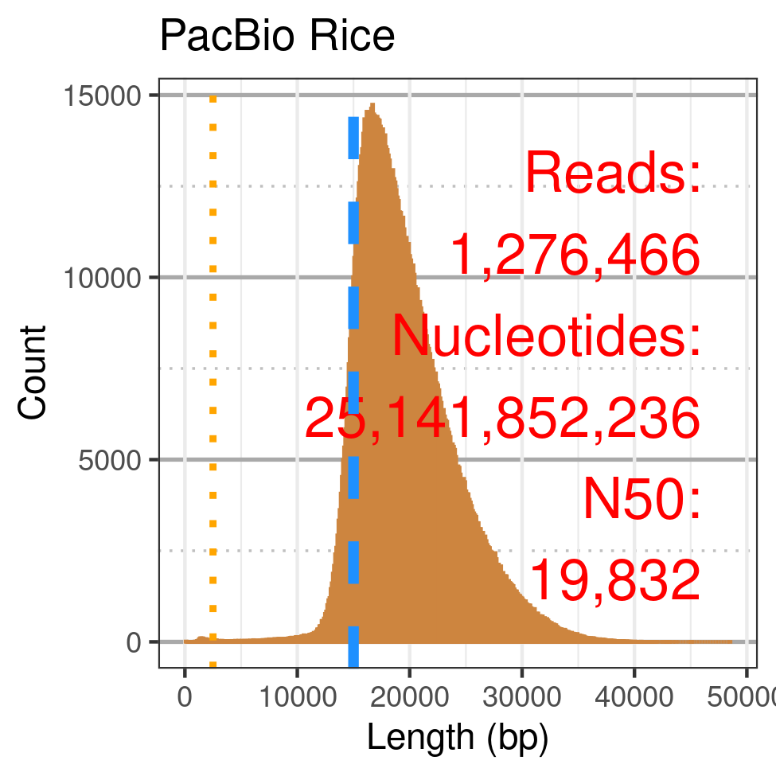
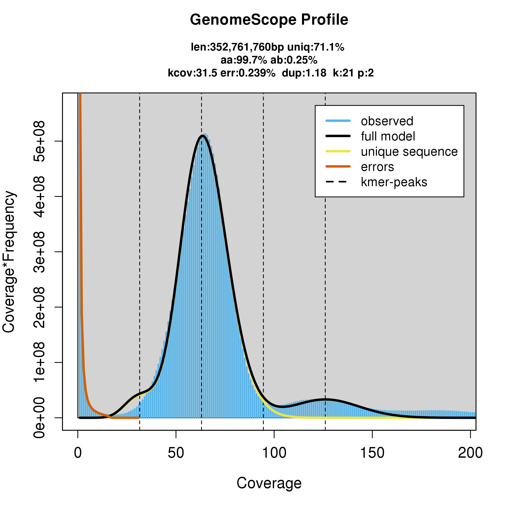
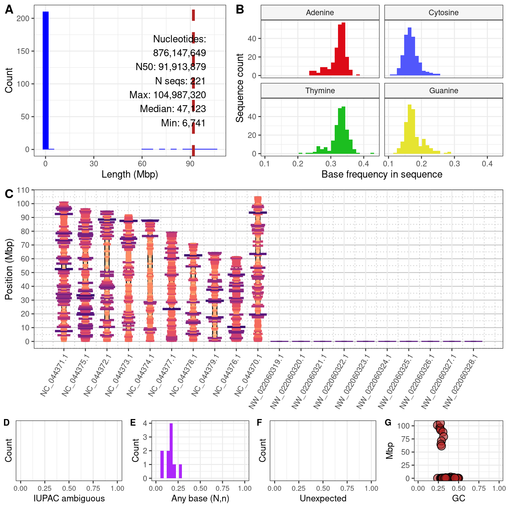
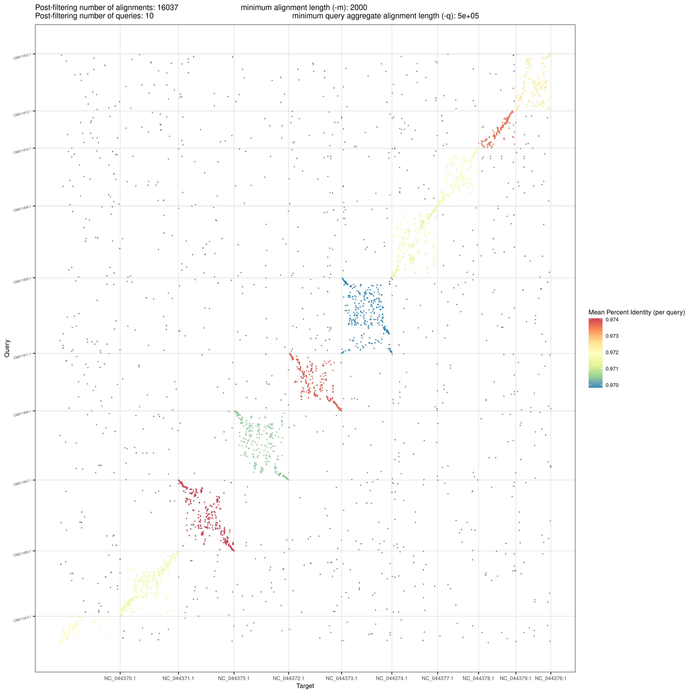

## Background


## File Formats


The product from a sequencing center is frequently referred to as a 'library'.
This library may be delivered in several forms.
Currently it is typical to receive these libraries in a text file that is in the FASTA or FASTQ format, and may be compressed using gzip.


Files in the FASTA and FASTQ format are simple text files, which can be opened with text editors, where the contents of the files are in a specified structure.
A FASTQ file contains records where each record spans 4 lines.
The first line begins with the '@' symbol followed by a unique identifier.
In the below example we see the first record with the line '\@m64047_220219_192831/18/ccs' as the unique identifier.
Compare this with other lines that begin with '@' to validate it's uniqueness.
The second line contains a sequence which typically consists of the characters A, C, G, and T.
The third line begins with '+' and may be blank or may repeat the unique identifier from the first line.
The forth line is a quality string where each nucleotide on the second line has a corresponding character on the third line to represent the quality of each nucleotide.
These quality characters are s single character that represents a probability that the nucleotide is correct.
Because it is encoded as a single character it needs to be looked up to translate it from this character to a probability.


```
@m64047_220219_192831/18/ccs
CATACCAGGTCGCACTGCCATGACATGTACAACCTCATCCCAGCTCAGGCTCACTCCTGTTAAGCTTTGCCTTTCCTTTA
+
rcc&6jqY~wmlUP[AWMvmqnxlfGg]^[VoWx[gW`>W\S9htZ_W~jbmsju6dggMkHm_b-utc\~7YgRi&YWB
@m64047_220219_192831/24/ccs
TTGTTAAATATTTAATTATTTATAAATTATAAGTTTAAAAATGATATTTTTTCTATATATATATATCATTTTTTCCTTAT
+
z~gd~O~~~~)~bk~n~^Pq~~~O~fa~umI~~\~~/~~~bw~x[eFp~~~~}~~~|Ix~|~u~~t~e:ryz~pOqi~{V
@m64047_220219_192831/34/ccs
GAATTTACCAAGTAAATCCACTAACTTATTAATTCCTCATTGCATCCACCATAGAACTTGGAATTGCACTCTCAGTTATG
+
hK\CbcYFd<RH@Bb]V7\VOIAZN@XWIWGU?DAMWQT=VRRVW7\@7X@KWP4T6MbFeBR1@=NDMWD0QVH)PRJ4
@m64047_220219_192831/35/ccs
TTAATTAAGATACTTTATATGTCTAAATTAATAAATATATTAAATGATAATATTATTTAATAATTATTTTTAAGTTATTA
+
~~~~~~~~~~~~~~~~~~~~~~~~~~~~~~~~~~~~~~~~~O~~~~~~~~~~~~~o~~~~~~~~~~_~~~~~~~~~~~~~
```

Biological sequence data stored in the FASTA format is similar to the FASTQ format but lacks a quality score for each nucleotide.
The first line begins with the character '>' followed by a unique identifier.
The next line contains the sequence.
The FASTA format may accomodate sequence data in a single line or wrapped over several lines.
The below example displays a single line for each sequence, as is currently typical for sequence libraries.


```
>m64047_220219_192831/18/ccs
CATACCAGGTCGCACTGCCATGACATGTACAACCTCATCCCAGCTCAGGCTCACTCCTGTTAAGCTTTGCCTTTCCTTTA
>m64047_220219_192831/24/ccs
TTGTTAAATATTTAATTATTTATAAATTATAAGTTTAAAAATGATATTTTTTCTATATATATATATCATTTTTTCCTTAT
>m64047_220219_192831/34/ccs
GAATTTACCAAGTAAATCCACTAACTTATTAATTCCTCATTGCATCCACCATAGAACTTGGAATTGCACTCTCAGTTATG
>m64047_220219_192831/35/ccs
TTAATTAAGATACTTTATATGTCTAAATTAATAAATATATTAAATGATAATATTATTTAATAATTATTTTTAAGTTATTA
```


## Evaluating Sequence Libraries


ccs.Q20 directory


When we receive these files from a sequencing run we will want to characterize their properties to help determine if downstream processing, such as assembly, may be successful.
These properties may include the following.

- Number of sequences
- Number of nucleotides
- How these nucleotides are arranged into sequences


```{r, echo=FALSE, fig.align='center', fig.cap="**Figure 1.** Summary of a FASTQ library.", out.width = '50%'}
#
```


### Sequenced read length histogram


```{r, fig.align='center', fig.cap="**Figure 1.** Summary of a FASTQ library.", fig.height=3, fig.width=5}
my_reads <- read.csv("m64013e_210227_222017.hifi_reads_nuccomp.csv.gz")
# my_reads[1:3, 1:2]

library(ggplot2)

my_binwidth = 1
p <- ggplot( data = my_reads, mapping = aes( x = Length/1e3) )
#p <- p + geom_histogram( binwidth = 1, color="black", fill="#3CB371" )
#p <- p + geom_density(alpha=.2, fill="#FF6666")
#p <- p + geom_histogram( binwidth = 1, color="black", fill="#3CB371" )
#p <- p + geom_density(alpha=.2, fill="#FF6666")
# p <- p + geom_density( aes( y = ..density.. * (nrow(my_reads) * my_binwidth) ),
#                        colour="black", fill="#C0C0C000", linewidth = 1.4)
p <- p + geom_histogram( color="black", fill="#3CB371", binwidth = my_binwidth )
# p <- p + geom_density( aes( y = after_stat(density) * (nrow(my_reads) * my_binwidth) ),
#                        colour="#808080", fill="#C0C0C000", 
#                        linewidth = 1.4, linetype = "solid")
p <- p + theme_bw()
p <- p + xlab( "Length (Kbp)" )
p <- p + ylab( "Number of reads" )
p
```


A histogram is a versatile tool to visualize the length distribution of sequences.
Here we see that we have sequence lengths (the x-axis) that range from near zero to almost 50 Kbp.
The more abundant sequences range from around 10 to 35 Kbp, with 17 Kbp being the most common or abundant length of sequence.
In order to determine if this is a 'good' distribution we may compare it to product literature, or we may want to compare it to a collection of other libraries.
Once we know the distribution of sequence lengths we can determine if we should proceed to assembly or if we may need to attempt to mitigate our library somehow.


## Running hifiasm


```
hifiasm -o myassembly_hifiasm -t 16 --n-hap 2 ../m64013e_210227_222017.hifi_reads.fastq.gz
```

Options include the following.    
-o STR       prefix of output files [hifiasm.asm]    
-t INT       number of threads [1]    
--primary    output a primary assembly and an alternate assembly    
--n-hap      INT number of haplotypes [2]    


The software 'hifiasm' used on Pacific Bioscience's 'hifi' reads is a current best practice for genome assembly.
Sequence reads that were produced using PacBio's 'hifi' technology are provided in the FASTQ format are assembled using this software in less than 24 hours.


- [hifiasm on GitHub](https://github.com/chhylp123/hifiasm)
- [hifiasm on Read the Docs](https://hifiasm.readthedocs.io/en/latest/index.html)
- @cheng2021haplotype
- [Pacific-Biosciences-Glossary-of-Terms](https://www.pacb.com/wp-content/uploads/2015/09/Pacific-Biosciences-Glossary-of-Terms.pdf)


## GenomeScope


```{r, echo=FALSE, fig.align='center', fig.cap="**Figure 2.** GenomeScope histogram.", out.width = '50%'}

```


The distribution of k-mers, subsets of the observed reads to a standard length (such as 31 bp) can be informative on the sequence depth for homozygous regions of an assembly, as well as other inferences.
GenomeScope presents itself as a 'reference free' method because it uses a sequence library and not the assembly made from the library.
It requires preprocessing of the input sequences with a k-mer counting software, such as JellyFish.
Because hifiasm does produce a k-mer histogram in it's standard error it might be useful to see this as a step to explore after hifiasm assembly also.
The histogram produced by GenomeScope typically consists of a major peak that indicates the sequence depth of the homozygous fraction of the assembly.
Minor peaks corresponding to heterozygous regions are typically present as well, in genomes where heterozygosity is expected.


- [Jellyfish](https://genome.umd.edu/jellyfish.html#Release) mer counter
- [GenomeScope](http://qb.cshl.edu/genomescope/genomescope2.0/)


## Evaluating Assemblies


```{r, echo=FALSE, fig.align='center', fig.cap="**Figure 3.** Summary of the CBDRx assembly (FASTA file).", out.width = '70%'}

```


## BUSCO


```
# BUSCO version is: 5.0.0 
# The lineage dataset is: eudicots_odb10 (Creation date: 2020-09-10, number of s
# Summarized benchmarking in BUSCO notation for file /nfs3/HORT/Vining_Lab/GENOM
# BUSCO was run in mode: genome
# Gene predictor used: metaeuk

        ***** Results: *****

        C:94.0%[S:87.5%,D:6.5%],F:0.8%,M:5.2%,n:2326       
        2187    Complete BUSCOs (C)                        
        2036    Complete and single-copy BUSCOs (S)        
        151     Complete and duplicated BUSCOs (D)         
        18      Fragmented BUSCOs (F)                      
        121     Missing BUSCOs (M)                         
        2326    Total BUSCO groups searched 
```

Benchmarking Universal Single-Copy Orthologue (BUSCO) uses a database of conserved genes and quesries these sequences against an assembly to determine if these sequences are present and reports this information as a measure of gene space completeness.
There are actually several databases that are focused on different parts of the phylogeny of life, so it is important to determine which database was used when making comparisons among assemblies.
The relative abundance of these genes reported found in a new assembly as single copy, duplicated (two or more copies), fragmented, or missing are taken as a measure of assembly quality.


- [BUSCO](https://busco.ezlab.org/) at EZlab


## Dotplots


```{r, echo=FALSE, fig.align='center', fig.cap="**Figure 4.** Dotplot comparing the CBDRx and Finola assemblies (FASTA files).", out.width = '70%'}

```


Dotplots are a method to compare two assemblies (FASTA files) to one another.
They begin with aligning the sequences using minimap2 and are then visualized with several options.
An important detail is that the comparisons are typically 'local' alignments, meaning that the part of the query and the part of the target are reported, but this does not mean that the entire sequences had a good match.
This means that the sequences in the files are typically represented by many matching subsequences in the plot.
A line extending from the lower left to the upper right represents a line of identity, but this line may consist of many segments, so interpretationj will be important.


- [minimap2](https://github.com/lh3/minimap2) on GitHub
- [D-Genies](https://dgenies.toulouse.inra.fr/)
- [pafr](https://cran.r-project.org/web/packages/pafr/index.html) on CRAN
- [dotPlotly](https://github.com/tpoorten/dotPlotly)


## SyRI 

Synteny and Rearrangement Identifier


- [SyRI](https://github.com/schneebergerlab/syri) on GitHub
- [SyRI](https://schneebergerlab.github.io/syri/) on GitHub pages
- [plotsr](https://github.com/schneebergerlab/plotsr) on GitHub


## References

